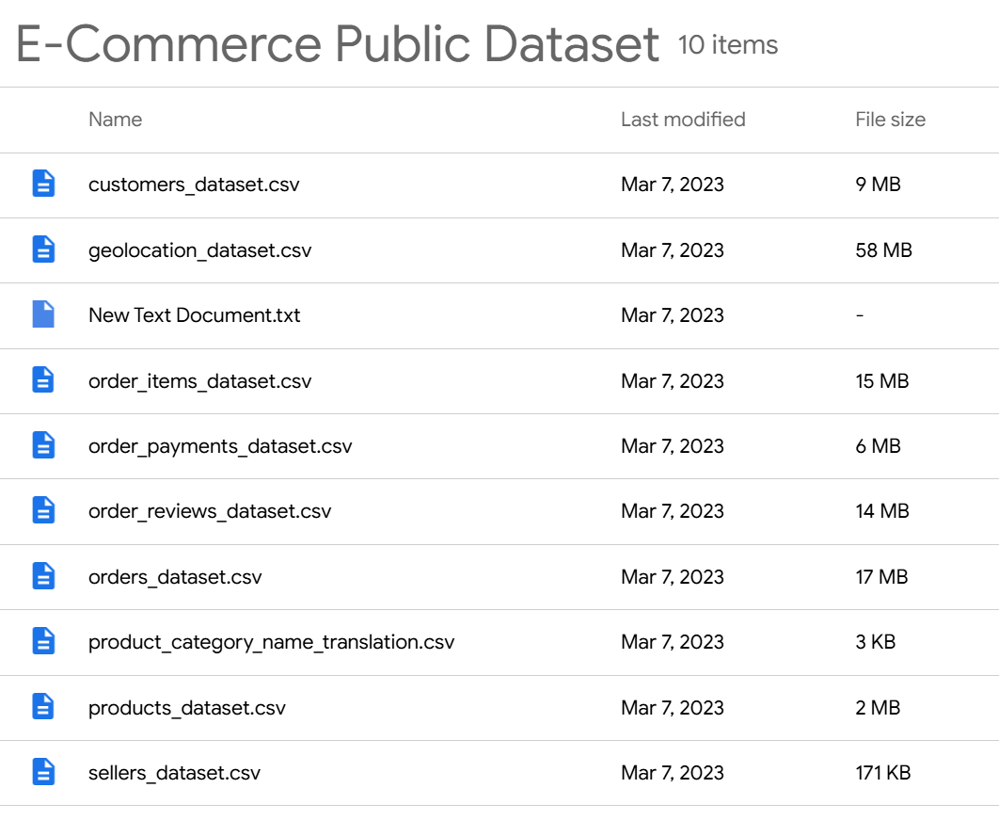
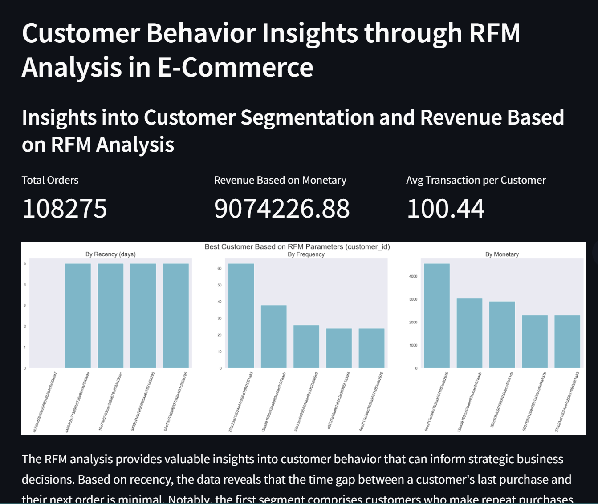
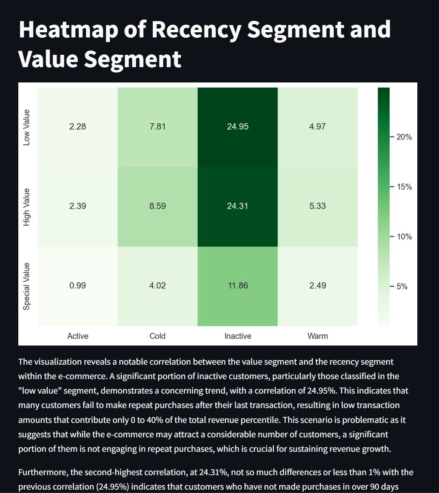

# **Analysis Data Project: Customer Behavior Insights through RFM Analysis in E-Commerce**

## **🌐 Background** :
E-commerce has become a popular platform for all age groups, offering convenience and easy access to online shopping. For a business owner, attracting active customers is key, motivating me to perform RFM analysis to segment customers based on their purchasing behavior.

## **❗ Problem Statement** :
As e-commerce continues to grow, businesses face the challenge of engaging and retaining active customers. Identifying customer segments based on their purchasing behavior is crucial. Through RFM analysis—focusing on Recency, Frequency, and Monetary factors—I aim to uncover valuable insights that can improve business processes and increase profitability.

## **📜 Data Source** :
This project is part of the Dicoding Academy course, and the dataset used is provided by them. You can access the dataset through the following link:
[E-Commerce Public Dataset](https://drive.google.com/file/d/1MsAjPM7oKtVfJL_wRp1qmCajtSG1mdcK/view)

#### **Dataset Overview** :



## **Setup Environment - Shell/Terminal**
```
mkdir analyst_project
cd analyst_project
pipenv install
pipenv shell
pip install -r requirements.txt
```

## **Run Streamlit App**
```
streamlit run dashboard/dashboard.py
```
## **Streamlit Overview** :


